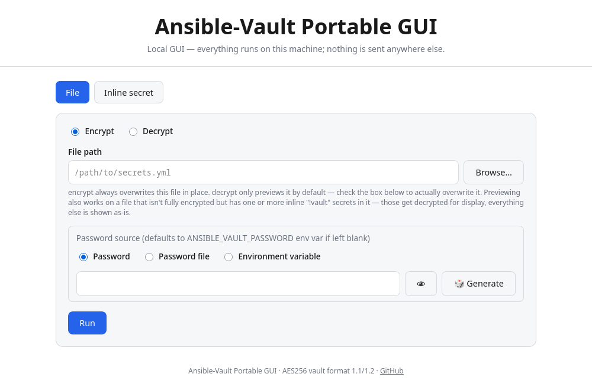

# Ansible-Vault Portable GUI



A minimal, dependency-light local GUI for encrypting and decrypting
[Ansible Vault](https://docs.ansible.com/ansible/latest/vault_guide/index.html)
files and inline `!vault` secrets — written in Go, with no dependency on
Python or `ansible-core`. Ships as a single static binary for Linux,
Windows, and macOS: `ansible-vault-portable-gui`.

Implements the standard **AES256** vault cipher (format `1.1`/`1.2`):
PBKDF2-HMAC-SHA256 key derivation, AES-256-CTR encryption, and an
HMAC-SHA256 integrity check — the same scheme `ansible-vault` itself uses.

## Features

- Encrypt / decrypt whole files in place, or preview the result without
  touching the file
- Encrypt / decrypt a single secret inline, as the `name: !vault |` block
  format Ansible uses for individual vaulted variables in a plaintext file
- Runs entirely locally: a small web server on `127.0.0.1`, opened in
  your default browser — no data ever leaves the machine
- No console window on Windows, and nothing left running afterward — it
  starts silently and stops itself when its browser tab is closed
- Password via the form, a file, an environment variable, or the standard
  `ANSIBLE_VAULT_PASSWORD` environment variable
- Single static binary, no runtime dependencies, cross-compiles cleanly
  for Linux, Windows, and macOS

## Installation

Grab the binary for your OS from the
[latest release](https://github.com/SpikePy/Ansible-Vault-Portable-GUI/releases/latest) —
no install step, just run it.

### Build from source

Requires Go 1.21+.

```sh
git clone <this-repo>
cd ansible-vault-portable-gui
go build -o ansible-vault-portable-gui .
```

### Cross-compile

```sh
GOOS=linux   GOARCH=amd64   go build -ldflags="-s -w" -o dist/ansible-vault-portable-gui .
GOOS=windows GOARCH=amd64   go build -ldflags="-s -w -H=windowsgui" -o dist/ansible-vault-portable-gui.exe .
GOOS=darwin  GOARCH=amd64   go build -ldflags="-s -w" -o dist/ansible-vault-portable-gui-macos-amd64 .
GOOS=darwin  GOARCH=arm64   go build -ldflags="-s -w" -o dist/ansible-vault-portable-gui-macos-arm64 .
```

`-H=windowsgui` marks the Windows binary as a GUI-subsystem app, so it
never briefly flashes a console.

## Usage

```sh
ansible-vault-portable-gui
```

Or, on Windows, double-click `ansible-vault-portable-gui.exe`. A local
server starts (`127.0.0.1:47990` by default) and opens in your browser —
no arguments needed for everyday use. Everything stays on `localhost`:
the server only listens on loopback, and every request carries a random
per-session token embedded in the page.

Closing the browser tab stops the server automatically — nothing is left
running. Reloading the page (F5/Ctrl+R) is safe and won't kill it.
Ctrl+C also works from the launching terminal. Run a second instance on
another port with `-addr 127.0.0.1:<other-port>` (its remembered settings
are separate from the default instance's, since browser storage is keyed
by origin).

### File tab

Has an Encrypt/Decrypt radio and an **Enable file overwrite** checkbox,
**unchecked by default** — both actions only preview the result unless
you check the box, which then makes Run overwrite the file in place.
Encrypt refuses to run if the file already looks encrypted, so it never
double-encrypts by mistake. Decrypt also handles a file that isn't fully
vault-encrypted but has inline `!vault` secrets in it (see below) —
previewed decrypted, everything else shown as-is; such a file can only
ever be previewed, never overwritten, so the checkbox is forced off for
it (this restriction is specific to Decrypt; encrypting such a file is
fine).

Also on this tab: a live read-only preview of the file's current on-disk
content, a **Browse…** button for server-side directory picking (a
browser's native file picker can't expose real filesystem paths), and a
password generator (see below).

### Inline secrets

Ansible supports vault-encrypting a single variable inside an otherwise
plaintext file, using an inline `!vault` block:

```yaml
db_password: !vault |
    $ANSIBLE_VAULT;1.1;AES256
    663834396532363364626265666530...
```

The Inline tab's Encrypt mode produces exactly that block: give it a
variable name (optional — leave it empty for a bare `!vault |` block) and
a secret. Decrypt mode reads it back — paste the block as-is, with or
without its `name:` prefix or header line; it finds the `$ANSIBLE_VAULT`
header wherever it appears. Encrypt mode can wrap the output at 80
characters per line (default) or keep it as one line; both decrypt the
same either way.

## Supplying the password

Checked in this order:

1. The password field, typed directly
2. A password file
3. An environment variable name
4. The `ANSIBLE_VAULT_PASSWORD` environment variable, if none of the
   above are set

A few smaller conveniences around the password fields:

- Each mode (Password / Password file / Environment variable) remembers
  its own value independently, so switching between them doesn't lose or
  mix up what you'd typed
- **🎲 Generate** (shown when encrypting with "Password" selected) opens
  a popover to set the password length and which character classes to
  use — lowercase, uppercase, digits, and symbols (limited to `!?@#$%&*+-=`)
  — with an option to avoid similar-looking characters (`0`/`O`, `1`/`l`/`I`)
- The file path and password-file fields offer a dropdown of the last 5
  distinct paths used
- All settings — including passwords — are remembered in the browser's
  local storage (plaintext, so fine on a personal machine, worth noting
  on a shared one); this is also why the port defaults to a fixed value
  rather than a random one

## Notes

- Only the AES256 cipher (vault format `1.1`/`1.2`) is supported — this is
  the default and by far the most common Ansible Vault format.
- Wrong-password and corrupted-file cases are both caught by the HMAC
  check before any plaintext is produced.
- File writes are atomic (temp file + rename), so a crash or a full disk
  mid-write can't leave a corrupted file behind.
